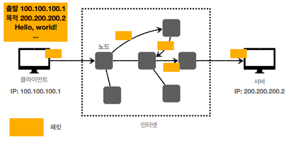
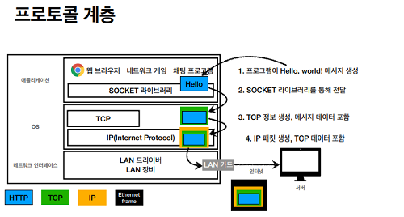

# 인터넷 네트워크

## IP(Internet Protocol)

인터넷 상에서 두 PC가 통신하기 위해선 IP주소(IP Address)가 필요

지정한 IP주소에 데이터를 전달하기 위한 규약으로 패킷(Packet)이라는 통신 단위로 데이터를 전달

패킷엔 출발지IP, 목적지IP, 전송데이터 등등.. 정보가 담겨있고 각 정보를 담아 클라이언트가 패킷을 전달(요청)하면 서버도 패킷을 전달(응답)



이러한 IP에는 한계가 존재

1. 비연결성

   - 패킷을 받을 대상이 없거나 서비스 불능 상태여도 패킷전송
   - 즉, 상대의 상태를 모름

2. 비신뢰성

   - 패킷이 중간에 유실되거나,
   - 패킷의 순서가 바뀔 가능성이 있음
   - 패킷 단위로 쪼개진 데이터가 온전히 도착한단 보장이 없음

3. 프로그램 구분

   - 같은 IP를 사용하는 서버에서 통신하는 애플리케이션이 둘 이상일 때 이를 구분하는데 한계가 존재

---

## IP 스택의 4계층

- 애플리케이션 계층 - HTTP, FTP
- 전송 계층 - TCP, UDP
- 인터넷 계층 - IP
- 네트워크 인터페이스 계층 - LAN드라이버, LAN장비...

1. 전송하고자 하는 데이터를 생성, Socket 라이브러리를 통해 전달
2. TCP, UDP 정보를 생성(데이터 포함)
3. IP패킷을 생성(TCP, UCP 정보를 포함)
4. LAN장비를 통해 전송



---

## TCP(Transmission Control Protocol)

IP의 한계를 보완하는 프로토콜로 다음과 같은 특징이 있음

1. 연결지향

   - 데이터를 전송하기 전 3 way handshake
     > SYN(접속 요청), SYN+ACK(접속 요청 및 수락), ACK(요청 수락)
   - 상대의 상태를 파악하고 데이터를 전송
   - 실제로 연결된 것은 아니고, 논리적으로 연결 (가상 연결)

2. 데이터 전달 보증

   - 데이터 전송 후, 결과를 응답해줌

3. 순서 보장
   - 패킷의 순서가 꼬일 경우, 올바른 순서 외에 패킷을 재요청

전송 계층에서 TCP 세그먼트에 출발지 PORT, 목적지 PORT, 전송제어 순서, 검증정보 등등..을 추가했기 때문에 가능

**위의 이유로 신뢰할 수 있는 프로토콜, 현재는 대부분 TCP를 사용**

---

## UDP(User Datagram Protocol)

- IP와 거의 같으나 PORT정보와 체크섬 정도만 추가
- 애플리케이션에서 추가 작업이 필요

---

## PORT

- 같은 IP 내에서 다른 요청을 받아도 PORT를 통해서 프로세스를 구분

---

## DNS(Domain Name System)

- IP는 변경될 수도 있고, 기억하기 어려움

- 도메인 명을 IP로 전환해주는 시스템

---

## Note

```
1. 학교에서 들었던 기억이 새록새록하다.
2. IP 프로토콜은 마치 역전앞 같은 말이니 IP 혹은 인터넷 프로토콜이라고 하자.
```
