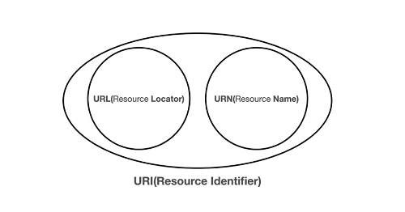
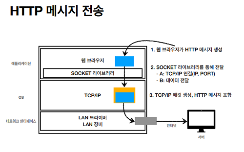

# URI와 웹 브라우저의 요청 흐름

## URI(Uniform Resource Idnetifier)

- Uniform : 리소스를 식별하는 방식
- Resource : URI로 식별할 수 있는 모든 자원
- Idnetifier : 다른 항목과 구분하는데 필요한 정보



리소스는 **URL(Locator)** 과 **URN(Name)** 으로 식별가능

URL은 리소스가 있는 위치를 지정하고, URN은 리소스의 이름 그 자체

URN만으로는 실제 리소스를 찾기 제한적이기에 보편적으로 URL을 사용

--임의로 작성한 강의 주소
scheme - https://
host - www.inflearn.com
port - scheme가 https이므로 생략가능(443)
path - /course/http-web-network/unit/61357
query - ?tab=curriculum
fragment - md에서 자주 봤던 #붙은 html의 위치..
등으로 구성

---

## 웹 브라우저 요청 흐름

1. 웹 브라우저에서 URL로 요청

2. DNS로 IP를 조회

3. HTTP 요청 메시지 생성

4. Socket 라이브러리를 통해 전달(애플리케이션 -> OS)

5. (TCP/IP로 가정) 3 way handshake을 통해 연결확인

6. TCP/IP 패킷 생성(HTTP 메시지 포함)

7. LAN 장비를 통해 전달

8. 응답 패킷 받음



---

## Note

```
1. 강의가 굉장히 짧았다. 조금만 일찍 왔으면 한 챕터 더 봤을텐데..
2. URN은 우편번호, URL은 도로명주소같은 느낌인가 싶다.
   물론 현실에서 우편번호는 주소를 특정하기 매우 쉽지만
```
