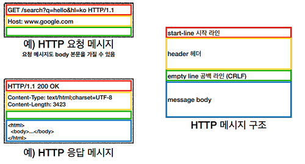

# HTTP 기본

## HTTP(Hyper Text Transfer Protocol)

서버간의 데이터를 주고 받을 때 대부분 HTTP를 사용

- HTML, TEXT
- IMAGE, 음성, 영상
- JSON, XML
- 거의 모든형태의 데이터 전송가능

  1.1버전을 주로 사용중이며 성능을 개선한 2버전, UDP를 사용하는 3버전이 진행 중

  HTTP의 특징

  1. 클라이언트(요청) 서버(응답) 구조
     - 각 단을 독립적으로 작성 가능
     - 단방향으로 진행
  2. 무상태 프로토콜(Stateless)을 지향
     - 클라이언트의 상태를 서버가 저장하지 않음
     - 요청정보를 클라이언트가 모두 들고 있으므로 모든 서버가 같은 응답가능
     - 서버를 수평 확장하는데 유리(Scale out)
     - 때로는 상태를 유지해야 하는 경우도 있음(로그인 등..)
  3. 비연결성(Connectionless)
     - 기본적으로는 통신 후 바로 연결을 끊는 구조
     - 연결과 해제에 많은 자원이 소요되므로 지속연결도 고려

---

## HTTP 메세지

1. 시작라인
   - 요청 : HTTP 메서드, 요청대상(경로와 쿼리스트링 등..), HTTP Version
   - 응답 : HTTP Version, HTTP 상태코드, 이유문구
2. 헤더
   - HTTP 전송에 필요한 모든 부가정보 포함
   - Content-Type, 인증, 압축, 캐시정보 등등..
   - 필요시 임의의 헤더 추가가능(당연히 임의 헤더를 사용하는 클라이언트와 서버간에만 사용가능)
3. 공백
   - 헤더와 바디를 구분해주는 공백 반드시 필요
4. 바디
   - 실제 전송할 데이터
   - 거의 모든 데이터 형식 전송 가능



> HTTP는 매우 단순하고 확장에 용이

---

## Note

```
1. 충분한 힘에는 기술이 필요없다.. 서버를 편하게 늘릴 수 있도록 Stateless를 지향하자
2. HTTP는 기본적으로 비연결성이기 때문에 당연히 기본적으로 무상태 프로토콜이다
```
