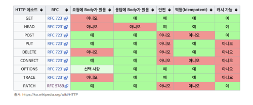

# HTTP 기본

## HTTP API 설계

- URI는 리소스만 식별
- 리소스(명사)와 행위(메서드)를 분리

---

## HTTP 메서드 종류

1. GET
   - 리소스 조회
   - 서버에 전달하고 싶은 데이터를 **쿼리스트링**으로 전달
   - 메시지 바디를 사용할 수 있지만, 지원하지 않는 곳이 많기에 권장하지 않음
2. POST
   - 요청 데이터 처리
   - **메시지 바디**를 통해 서버로 데이터 전달
   - 메시지 바디로 들어온 데이터를 처리하는 모든 기능 수행
     - 신규 데이터 등록
     - 기존 자원에 데이터 추가
     - POST의 결과로 리소스가 생성되지 않을 수도 있음
   - 쿼리스트링이 아닌 메시지바디로(ex. JSON)으로 조회해야 하는 경우 조회임에도 POST를 사용 가능
3. PUT
   - 리소스를 대체(없는경우 생성, 있는경우 덮어쓰기)
   - 클라이언트가 구체적인 리소스 위치를 식별
   - 리소스를 완전히 대체하기 때문에 부분변경 X
4. PATCH
   - PUT과 비슷하나 리소스를 부분적으로 변경
5. DELETE
   - 클라이언트가 구체적인 리소스 위치를 식별
   - 리소스를 제거

---

## HTTP 메서드 속성



1. 안전
   - 호출해도 리소스가 변하지 않음
   - GET
2. 멱등
   - 여러번 호출해도 최종결과가 같음
   - GET, PUT, DELETE
   - 자동복구 등(응답없을시 여러번 호출)의 근거
   - PATCH는 설계에 따라 멱등할수도, 멱등하지 않을수도 있음
3. 캐시가능
   - 응답 결과 리소스를 캐시가능
   - GET, HEAD, POST, PATCH
   - POST, PATCH는 본문 내용(body)도 캐시 키로 고려해야해서 잘 사용하지 않음

---

## Note

```
1. 멱등은 간단하게 여러번 실행해도 괜찮은가로 판단하면 될 것 같다
   동일한 요청이면 GET, PUT, DELETE는 결과가 같지만
   POST는 데이터가 계속 쌓이니 멱등하지 않다

2. PUT은 요청데이터로 리소스를 대체하지만 PATCH는 설계에 따라 리소스의 일부에
   대하여 변경을 명령할 수 있기에 멱등하지 않음

3. HTTP는 통신을 위한 규악이고 스펙상 동장에 차이가 있지만 설계하기 나름..
```
