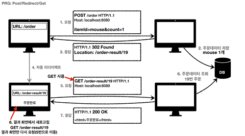

# HTTP 상태코드

## 상태코드

- 클라이언트가 보낸 요청의 처리 상태를 응답해서 알려주는 기능
- 응답 메시지 헤더 스타트라인에 기입


모르는 상태코드를 응답받아도, 상위 상태코드로 해석하여 처리
ex) 299 ??? -> 2xx

---

## 1xx (Informational)

- 요청이 수신되어 처리중
- 거의 사용되지 않음

---

## 2xx (Successful)

- 200 OK : 요청성공
- 201 Created : 요청이 성공하여 리소스가 생성
- 202 Accepted : 요청이 접수되었으나 처리 미완료(배치 처리 등..)
- 204 No Content : 요청이 성공하였으나 응답 메시지 본문에 담을 데이터가 없음

---

## 3xx (Redirection)

- 응답 결과에 Location 헤더가 있으면, Location 위치로 이동(Redirect)
- 이미 사용하지 않는 uri(ex. /event)로 요청이 오면 3xx코드와 Location을 메세지에 담아 전송, Location 위치로 이동
- 301 Moved Permanently
  - 리다이렉트 요청시 요청 메서드가 GET으로 변하고, 본문이 제거될 수 있음(May)
  - 메시지 바디에 값을 채우고, POST로 보냈지만 리다이렉트 요청에 따라 단순히 바뀐 Location을 GET하는 요청으로 바뀜(May)
- 308 Permanent Redirec
  - 301과 기능은 같으나 요청 메서드와 메시지 바디를 유지
    > 위 두개의 코드(301, 308)는 영구 리다이렉션 리소스의 URI가 영구적으로 이동, 원래의 URL을 사용 X, 검색 엔진 등에서도 변경 감지
- 302 Found
  - 리다이렉트 요청시 요청 메서드가 GET으로 변하고, 본문이 제거될 수 있음(May)
- 303 See Other
  - 302와 기능은 같으나 요청 메서드가 GET으로 변경
- 307 Temporary Redirect
  - 302와 기능은 같으나 요청메서드와 메시지 바디를 유지(MUST NOT)
    > 위 세개의 코드(302, 303, 307)는 일시적 리다이렉션 리소스의 URI가 일시적으로 변경, 검색 엔진 등에서 URL을 변경하면 안됨
- 300 Multiple Choice : 사용 X
- 304 Not Modified
  - 캐시를 목적으로 사용
  - 클라이언트에게 리소스가 수정되지 않았음을 알려줌
  - 서버가 내려주는 것이 아니라 로컬에 저장된 캐시를 재사용(캐시로 리다이렉트)
  - 로컬캐시를 사용해야 하므로 응답 메시지에 바디를 포함하지 않음
  - 조건부 GET, HEAD 요청시 사용

```
PRG(Post Redirect Get)

상품주문 후(POST) 2xx 상태코드를 받고 브라우저를 새로고침하면 이전 요청(POST)이 다시 요청됨
중복 주문 등의 문제가 생길 수 있기에 POST의 결과로 302, 303을 돌려주어 GET URL로 리다이렉트 시킴
새로고침 후에도 GET 요청만 발생하도록 막을 수 있음

중복 POST에 대한 경고가 아닌 GET 요청으로 만들어버릴 수 있어 사용성도 좋아짐
```



---

## 4xx (Client Error)

- 클라이언트의 요청에 문제(잘못된 문법, 구문, 메시지, 인증 등등..)
- 요청에 문제가 있기 때문에 잘못된 같은 요청은 항상 실패해야함
- 400 Bad Request
  - 클라이언트가 잘못된 요청(문법, 메시지, API 스펙, 파라미터 등등..)으로 서버에서 처리 불가
- 401 Unauthorized
  - 클라이언트가 해당 리소스에 대한 인증(Authentication)이 필요함
  - WWW-Authenticate 헤더와 함께 인증 방법을 설명
  - 인증(Authentication)과 인가(Authorization)를 구분하자
  - 영어로는 인가되지 않음이지만, 실제 사용은 인증되지 않음으로 사용
- 403 Forbidden
  - 요청을 이해했지만 승인을 거부함
  - 주로 인가되지 않은 사용자
- 404 Not Found
  - 요청 리소스를 찾을 수 없음
  - 인가되지 않은 사용자에게 403 코드를 보내주고 싶지 않을때도 사용(403은 비인가 사용자가 URL이 있다는 것을 알게되기 때문에)

---

## 5xx (Server Error)

- 서버 문제로 오류 발생
- 재시도 하면 성공가능성이 있음(서버 복구 등등..)
- 500 Internal Server Error
  - 서버 내부 문제로 오류 발생
- 503 Service Unavailable
  - 서비스 이용 불가
  - 서버가 일시적인 과부하 또는 예정된 작업으로 잠시 요청을 처리할 수 없음을 표시
  - Retry-After 헤더 필드로 얼마뒤에 복구되는지 보낼 수도 있음

> 500 에러는 서버에 문제가 있을 때만 사용(Validation Error등을 500으로 내려주면 안됨)

---

## NOTE

```
1. 달달 외우면 좋겠지만 대략적으로만 일단 알고 있자
2. HTTP 메서드와 마찬가지로 정해진 스펙은 있지만, 정말 딱딱하게 강제되는 것은 아니다
   알아서 잘 쓰도록 하자
```
