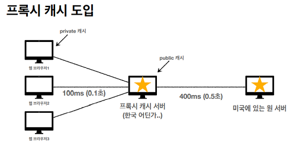

# HTTP 헤더 - 캐시와 조건부 요청

## 캐시 기본 동작

사진파일을 서버로 부터 내려 받는다고 했을 때, 캐시가 없는 경우는 같은 파일임에도 동일하게 내려받아야 함

- 인터넷 네트워크 동작은 매우 비싸고 느린 작업
- 브라우저 로딩 속도가 느리고, 사용자 경험이 나쁨

캐시 가능 시간(cache-control: max-age=60..)을 설정하고 응답 결과를 브라우저 캐시에 파일 등을 저장  
HTTP 요청 시에 브라우저에서 값을 가져오기 때문에 상기 문제가 해결되지만  
캐시 가능 시간이 지나면 서버를 통해 데이터를 다시 조회하고 캐시를 갱신해야함

> 캐시 가능 시간 만료후에도 캐시를 활용할 방법이 필요

---

## 검증 헤더와 조건부 요청1

캐시 만료후에도 캐시에 저장된 값을 활용하려면 서버에서 데이터를 변경하지 않았음을 확인 해야함

1. 캐시를 저장할 때 헤더에 데이터가 마지막으로 수정된 시간(Last-Modified: 2020년 11월 10일 10:00:00)을 같이 저장
2. HTTP 요청시 캐시에 저장된 마지막 수정 시간과 서버파일의 마지막 수정 시간을 비교(if-modified-since)
3. 값이 같으면 캐시에서 값을 조회
   - HTTP 응답 메시지가 200 OK 등이 아닌 304 Not Modified로 응답(3xx 응답이므로 바디에 값이 없음)
   - 캐시로 리다이렉트
4. 값이 다르면 서버에서 값을 내려받고 캐시를 업데이트
   - 정상적으로 200 OK 등을 응답받고 서버에서 값 조회

> 매우 실용적인 해결 방법이나 Last-Modified, If-Modified-Since의 단점이 존재

- 1초 미만 단위로 조정이 불가능
- 날짜 기반의 로직 사용
- 서버에서 별도의 캐시 로직을 관리하기 어려움(가령 어떤 수정 범위까지는 동일한 데이터로 취급하고 싶다거나..)

---

## 검증 헤더와 조건부 요청2

데이터가 마지막으로 수정된 시간이 아닌 ETag(Entity Tag)를 사용하여 캐시 관리  
캐시용 데이터에 임의의 이름을 설정 ex) ETag: "v1.0", ETag: "a2jiodwjekjl3  
If-Modified-Since가 아닌 If-None-Match를 사용(None임을 주의하자)

- 캐시 제어 로직을 서버에서 분리 가능
- 클라이언트는 ETag의 의미를 모르고 서버에 단순 제공
- ETag 일괄 갱신 등이 가능함

---

## 캐시 제어(Cache-Control)

캐시 지시어(directives)

- Cache-Control: max-age : 캐시 유효 시간, 초 단위
- Cache-Control: no-cache : 데이터는 캐시해도 되지만, 항상 원(origin) 서버에 검증하고 사용
- Cache-Control: no-store : 데이터에 민감한 정보가 있으므로 저장하면 안됨(메모리에서 사용하고 최대한 빨리 삭제)

---

## 프록시 서버

프록시 캐시 서버에 캐시를 쌓아두고 원서버 대신 응답하도록 설계  


캐시 지시어(directives) - 기타

- Cache-Control: public : 응답이 public 캐시에 저장되어도 됨
- Cache-Control: private : 응답이 해당 사용자만을 위한 것임, private 캐시에 저장해야 함(기본값)
- Cache-Control: s-maxage : 프록시 캐시에만 적용되는 max-age
- Age: 60 (HTTP 헤더) : 오리진 서버에서 응답 후 프록시 캐시 내에 머문 시간(초)

---

## 캐시 무효화

- Cache-Control: no-cache
- Cache-Control: no-store
- Cache-Control: must-revalidate
  - 캐시 만료후 최초 조회시 원 서버에 검증해야함
  - 원 서버 접근 실패시 반드시 오류가 발생해야함 (504 Gateway Timeout)
  - must-revalidate는 캐시 유효 시간이라면 캐시를 사용함
- Pragma: no-cache
  - HTTP 1.0 하위 호환(있다는 것만 알아두자..)

no-cache는 원서버에 검증을 요청해야 하지만, 프록시 캐시 서버 설정에 따라 원서버에 접근할 수 없어도 캐시데이터를 반환할 수 있음  
must-revalidate는 원서버에 접근할 수 없는 경우 항상 오류가 발생해야 함

---

## NOTE

```
1. 드디어 완강이다.. 외울건 좀 있지만 내용이 크게 어려운 건 아니니 꾸준히 복습하자.
```
